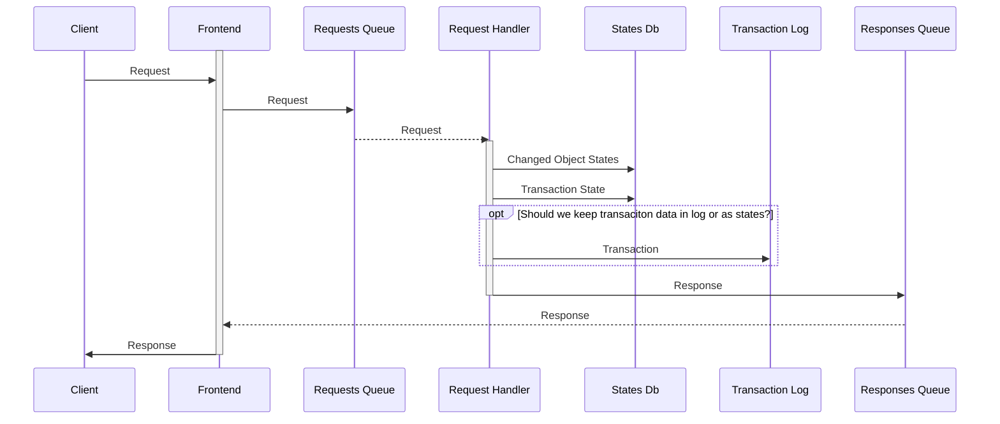

https://mermaidjs.github.io/mermaid-live-editor

# Request Handling

- Each `Frotnend` has its own `Response Queue`
- Request
  - Modification operation, JSON
  - Sync, Binary package Avro
  - View, JSON
  - Upload big data attachment
  - Download big data
  
   
  