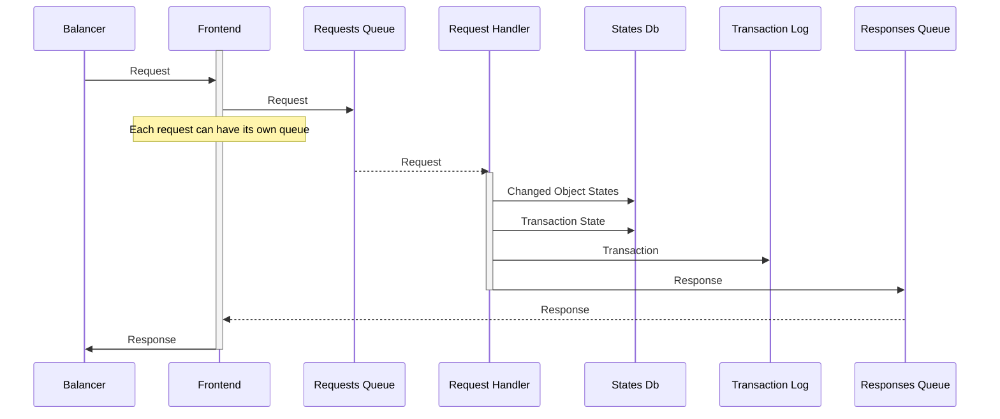

https://mermaidjs.github.io/mermaid-live-editor

# Request Handling



- Each `Frotnend` has its own `Response Queue`
- Request
  - Modification operation, JSON
  - Sync, Binary package Avro
  - View, JSON
  - Upload big data attachment
  - Download big data

# Balancer

Balance incoming traffic to frontends

Service which uses a tool like `traefik` or `nginx`

# Frotnend

Save the request to a queue

- Use request fields to find a queue

# Requests Queue

Keep requests

- Request is deleted after it is processed

# Request Handler

Handle requests using `eventual atomicity` approach

- Check and reject Requests (say no permissions to perfom given operation)
- Update object states
- Feed `Transaction Log`

# States Db

Persistency to provide `eventual atomicity`

- Each request can modify one or few states
- Eventually all modifications must be either applied or compensated

Design details:

- Each state has a key
- State is a `dedicated` (`выделенное состояние`) if only one transaction can own the state
- State is `shared` (`разделяемое состояние`) if few transactions can be applied. Shared states must keep list of all applied transactions

Example: customer must have unique email 

- Two states are needed to handle this requirement
- `Customer Email` is a dedicated  state, has an `email` as a key and `Customer.id` as a value
- `Customer Data` is a shared state, has `customer.id` as a key and customer fields as a value
- `Create Customer` reqest  first try to create  `Customer Email` state, if ok, `Customer Data` is created
- `Update Customer` request first try to create  `Customer Email` state for a new email value, then update `Customer Data` state and finally deactivate previous `Customer Email`

# Transaction Log

Purpose: 
- Keep processed transactions (both, "commited" and "rejected")
- Effective rescan of processed transactions

`Requests Queue`, `States Db` and `Transaction Log` can be implemented as a single database table for the price of perfomace and scalability.

# Special Scenarious

- Sync logs
- ??? Request id - can we use client on or always use internal id (say, queue offset)
- Serivce call (Send email)

# Misc

Java as microservices
- https://codeburst.io/microservices-in-java-never-a7f3a2540dbb

Nakadi
- https://github.com/zalando/nakadi
- Validates schemas - no

Exactly once
- https://segment.com/blog/exactly-once-delivery/
- https://dzone.com/articles/kafka-clients-at-most-once-at-least-once-exactly-o
- Kafka https://stackoverflow.com/questions/29647656/effective-strategy-to-avoid-duplicate-messages-in-apache-kafka-consumer
- https://www.confluent.io/blog/exactly-once-semantics-are-possible-heres-how-apache-kafka-does-it/
- https://cwiki.apache.org/confluence/display/KAFKA/KIP-98+-+Exactly+Once+Delivery+and+Transactional+Messaging


- Binding keys, routing keys https://habrahabr.ru/post/201096/
- Architecture description https://technet.microsoft.com/en-us/library/bb124225(v=exchg.65).aspx

```puml {align="center"}
a->b
```

 ```ditaa {cmd=true args=["-E"]}
  +--------+   +-------+    +-------+
  |        | --+ ditaa +--> |       |
  |  Text  |   +-------+    |diagram|
  |Document|   |!magic!|    |       |
  |     {d}|   |       |    |       |
  +---+----+   +-------+    +-------+
      :                         ^
      |       Lots of work      |
      +-------------------------+
  ```