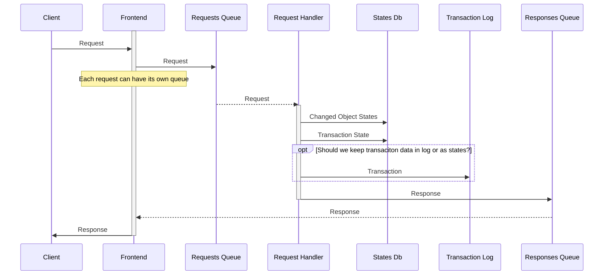

https://mermaidjs.github.io/mermaid-live-editor

# Request Handling

- Each `Frotnend` has its own `Response Queue`
- Request
  - Modification operation, JSON
  - Sync, Binary package Avro
  - View, JSON
  - Upload big data attachment
  - Download big data

  
# States Db

Why we need `States Db`? To provide `eventual atomicity`.

- Each request can modify one or few states
- Each state has a key
- State is a `dedicated` if only one transaction can own the state key. Dedicated state keeps owner
- State is `shared` if few transactions can be applied. Shared states must manage lists of applied transactions.

Example: customer must have unique email 
- Two states are needed to handle this requirement
- `Customer Email` is a dedicated  state, has an `email` as a key and `Customer.id` as a value
- `Customer Data` is a shared state, has `customer.id` as a key and fields as a value
- `Create Customer` operation first try to create  `Customer Email` state, if ok, `Customer Data` is created