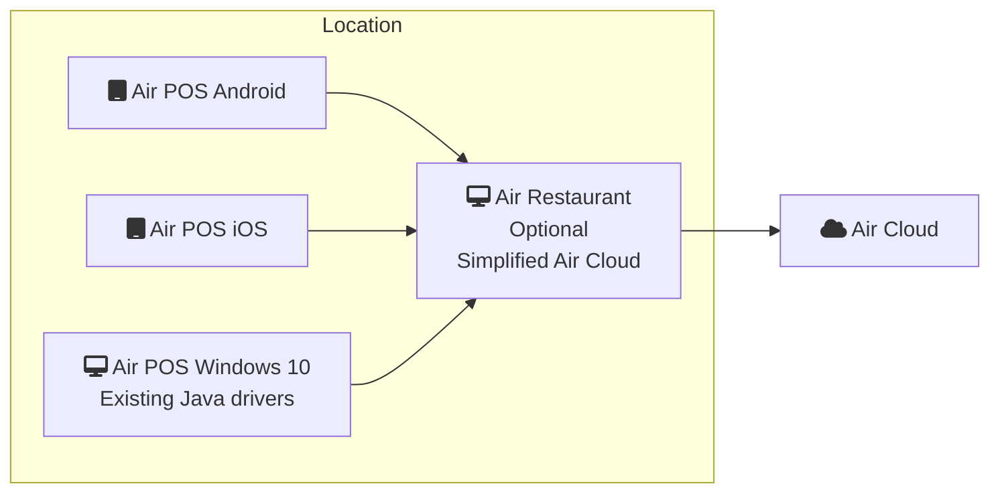
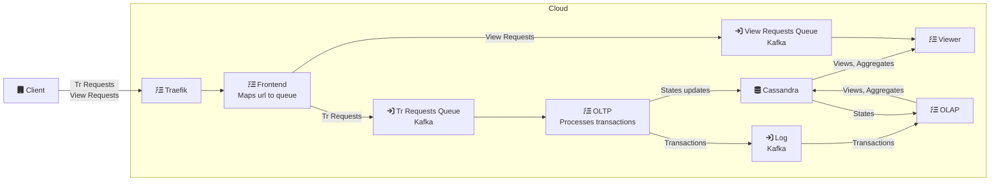

#Location

```mermaid
graph LR
    
subgraph Location
    Android["fa:fa-tablet Air POS Android"]
    iOS["fa:fa-tablet Air POS iOS"]
    Win10["fa:fa-desktop Air POS Windows 10<br>Existing Java drivers"]    
    AirRestaurant[fa:fa-desktop Air Restaurant<br>Optional<br>Simplified Air Cloud]

    Android-->AirRestaurant
    iOS-->AirRestaurant
    Win10-->AirRestaurant
end

AirRestaurant-->AirCloud["fa:fa-cloud Air Cloud"]

```

# Air Cloud

```mermaid
graph LR
    
Client["fa:fa-tablet Client"]--Tr Requests<br>View Requests-->Traefik

subgraph Cloud
    Traefik["fa:fa-tasks Traefik"]
    Frontend[fa:fa-tasks Frontend<br>Maps url to queue]
    TrRequestsQueue[fa:fa-sign-in Tr Requests Queue<br>Kafka]
    ViewRequestsQueue[fa:fa-sign-in View Requests Queue<br>Kafka]
    OLTP[fa:fa-tasks OLTP<br>Processes transactions]
    Viewer[fa:fa-tasks Viewer]    
    OLAP[fa:fa-tasks OLAP]
    Cassandra["fa:fa-database Cassandra"]
    Log[fa:fa-sign-in Log<br>Kafka]

    Traefik-->Frontend
    Frontend--Tr Requests-->TrRequestsQueue
    Frontend--View Requests-->ViewRequestsQueue
    TrRequestsQueue-->OLTP
    OLTP--States updates-->Cassandra
    OLTP--Transactions-->Log
    Log--Transactions-->OLAP
    OLAP--Views, Aggregates-->Cassandra
    Cassandra--States-->OLAP
    Cassandra--Views, Aggregates-->Viewer
    ViewRequestsQueue-->Viewer
end

```
